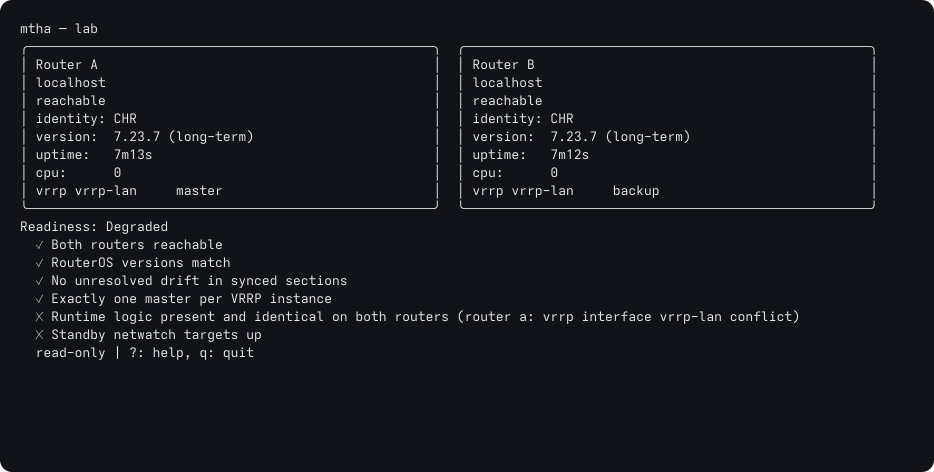
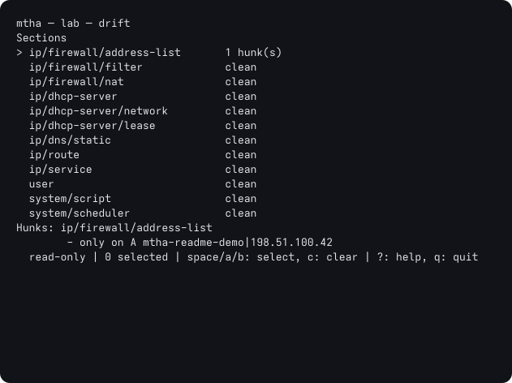
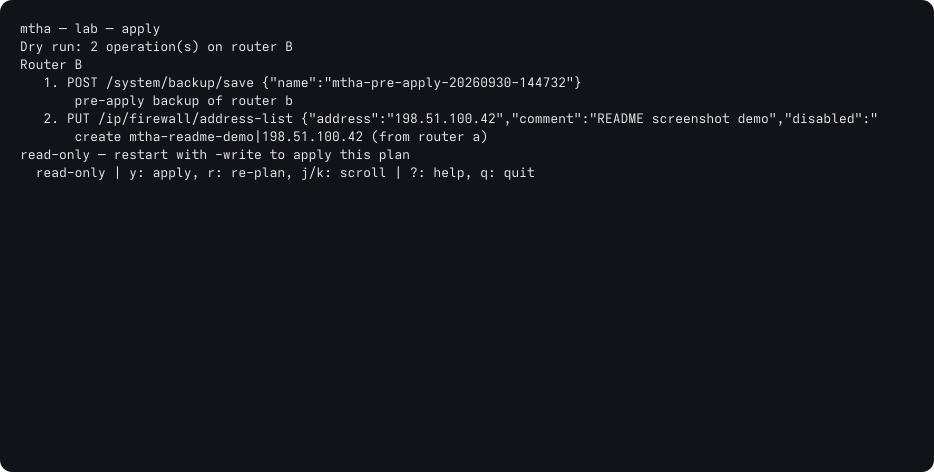
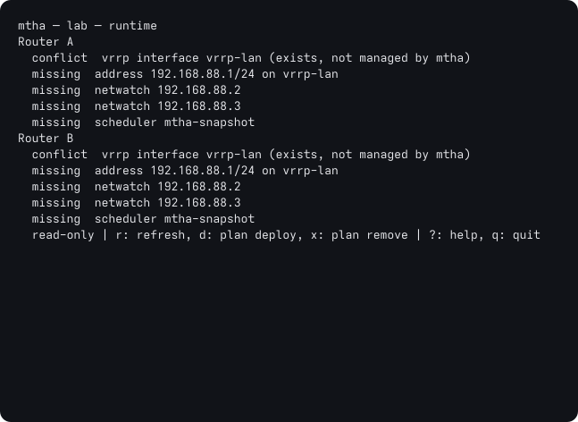
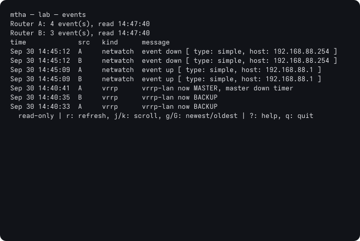
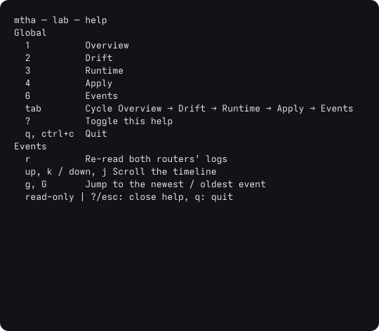

# mtha — MikroTik HA Pair Manager

`mtha` is an on-demand operator TUI for a pair of MikroTik RouterOS 7 routers
running VRRP. It answers the questions a two-router HA setup can't answer on
its own:

- Is the pair actually healthy, and could the standby take over right now?
- What configuration has drifted between the two routers?
- Push selected config differences in either direction, with a dry run,
  a pre-apply backup and post-apply verification.
- Deploy and verify the runtime failover logic.
- Rehearse a planned failover (planned; not implemented yet).

It is `kubectl`, not a control plane. Nothing that happens *during* a failure
depends on `mtha` running — VRRP, netwatch and the scripts that adjust
priority all live on the routers themselves. The tool is for designing,
deploying, verifying and syncing. Planned failover is specified but is not
implemented in this release.

> **Status:** Milestones 1–4, 6 and the in-app help portion of 7 are done:
> Overview, Drift, Runtime
> (VRRP interface provisioning, netwatch/on-master/on-backup/scheduler
> automation), Apply (selective sync with dry run, backup and verification),
> and Events (merged router log and apply/Runtime-action timeline). Milestone 5
> (planned failover) has not started. See [Status](#status) below.

## Requirements

- Go 1.27.1 (the version pinned in `go.mod` and `.mise.toml`)
- Two RouterOS 7 routers with the REST API (`www-ssl`) reachable over HTTPS
- A user on each router with read permissions; the API user needs
  `read` at minimum, and `write`/`policy` to use `-write` (required for the
  Runtime screen's deploy/remove and the Apply screen)

`mtha` speaks the RouterOS 7 REST API only. It does **not** speak the legacy
binary API on ports 8728/8729.

## Install

Download the archive for your platform from the
[GitHub Releases](https://github.com/dopyrory3/mikrotik-ha-manager/releases)
page (Linux amd64/arm64, macOS arm64, Windows amd64), check it against
`checksums.txt`, and put `mtha` on your `PATH`. `mtha -version` shows the
release it was built from.

To build from source:

```sh
git clone <repo> && cd mikrotik-ha-manager
make build                 # go build, stamped with the version from git describe
```

This produces an `mtha` binary in the current directory. A plain
`go build ./cmd/mtha` works too, but reports its version as `dev`. The build is a
static binary with no runtime dependencies; cross-compiling is a plain
`GOOS`/`GOARCH` pair.

## Quickstart

```sh
# 1. Write a commented starter pair file to the default location
mtha -init

# 2. Set one password per router — never stored in the pair file
export MTHA_CORE_A_PASSWORD=...
export MTHA_CORE_B_PASSWORD=...

# 3. Edit the pair file to match your routers
$EDITOR ~/.config/mtha/pairs.yaml

# 4. Run it (read-only by default)
mtha
```

The session opens on the **Overview** screen: side-by-side status for both
routers plus a single readiness verdict. Press `1` for **Overview**, `2` for
**Drift**, `3` for **Runtime**, `4` for **Apply**, `6` for **Events**, or `?`
for help on any screen: select hunks on Drift (`space`, or `a`/`b` for a
whole section), then review and run the plan on Apply.



See [docs/usage.md](docs/usage.md) for screens and keybindings, and
[docs/configuration.md](docs/configuration.md) for the pair file reference.

## Command-line flags

- `-config <path>` reads the pair file (default `~/.config/mtha/pairs.yaml`).
- `-pair <name>` selects a pair when the file defines more than one; it is
  optional when there is only one.
- `-write` enables confirmed write operations. Without it, the session is
  read-only.
- `-init` writes a commented sample pair file to `-config` and exits; it
  refuses to overwrite an existing file.
- `-version` prints the build version and exits.

The standard Go flag parser also supports `-h`/`-help` for flag help.

## Safety model

- **Read-only unless you ask.** Write operations require `-write`; the mode is
  shown in the status bar. Every write, including the Runtime screen's
  deploy/remove, is shown as a dry run first, even read-only. Only
  confirming with `-write` set actually writes anything, and only one write
  runs at a time.
- Credentials are resolved from the environment at run time and never read
  from, or written to, the pair file.
- All API traffic is HTTPS. `insecure_tls` is an explicit per-router opt-in
  for self-signed router certificates — prefer installing the router's CA
  certificate instead where you can.
- Every object Runtime deploys is tagged (`mtha:` comments, or a leading
  `# mtha:` line in a script body) so it can be verified and removed cleanly,
  and so it never silently overwrites a hand-written on-master/on-backup
  script or adopts a same-named hand-made object — those surface as
  `conflict` instead.
- Apply (and a Runtime deploy/remove, which runs through it) shows every
  REST operation before anything is written, starts each
  router's writes with `/system/backup/save`, and re-checks the plan against
  fresh reads just before running — if the routers changed, nothing is
  written and the new plan is shown instead. Writing to the current VRRP
  master (or a router whose VRRP state is unknown) takes a second, distinct
  confirmation (`Y`). Execution stops at the first failure, and drift is
  re-run afterwards to report anything still different. Failover will reuse
  the same pattern.

The Drift screen shows the differences selected for sync, and Apply shows the
resulting dry-run operations before confirmation:





Runtime shows the state of managed automation and Events shows the merged
router timeline. Press `?` for the built-in help overlay:







These are captures from a real RouterOS lab. To regenerate all six, bring up
instance 5 and run `MTHA_LAB_INSTANCE=5 docs/images/capture.sh`; the script
temporarily adds an address-list entry on router A to provide real Drift and
Apply output, then removes it. See [the screenshot generator](docs/images/capture.sh).

## Status

| Milestone | Scope | State |
| --- | --- | --- |
| 1. Skeleton | Pair config, REST client, dashboard with basic status and VRRP | Done |
| 2. Drift | Section readers, normaliser, diff engine, drift screen | Done |
| 3. Apply | Planner, dry run, backup, apply, verify | Done |
| 4. Runtime | Templates, deploy, verify, remove | Done |
| 5. Failover | Pre-flight, action, live view, VIP probe | Not started (outside this release) |
| 6. Events | Log merge, timeline | Done |
| 7. Polish | In-app help | Done |

A pair file may define several pairs; select one with `-pair <name>`.
Releases are built by GoReleaser from `v*` tags (see [Releasing](#releasing)).

## Documentation

| Document | Contents |
| --- | --- |
| [docs/configuration.md](docs/configuration.md) | Pair file reference, credentials, drift and normalisation rules |
| [docs/usage.md](docs/usage.md) | Command-line flags, screens, keybindings, readiness checks |
| [project.md](project.md) | Full product spec, architecture and milestones |

## Testing against real RouterOS

`testlab/docker-compose.yml` runs two RouterOS 7 CHR instances as a real VRRP
pair, so the tool can be exercised against a device rather than the
hand-written fixtures in `internal/routeros`:

```sh
docker compose -f testlab/docker-compose.yml up -d --build
./testlab/provision.sh           # address ether2 and build the VRRP pair
```

Stop it with `docker compose -f testlab/docker-compose.yml down`, adding `-v`
to drop the guest disks as well.

Then point a pair file at `https://localhost:443` and `https://localhost:8443`
(user `admin`, password `London12`) and run mtha. The two routers are bridged
onto a shared network, so VRRP forms and the VIP is pingable.

The stock image cannot be used as-is for this: it assigns the guest NIC's MAC
to the bridge port, which makes the in-container bridge drop traffic to the
guest, and it picks that port by the name `eth1`, which Docker does not keep
stable across a restart. `testlab/` patches both, and enables `www-ssl` (with
a throwaway self-signed certificate) since mtha speaks HTTPS only. See the
comments in `testlab/` for the details.

Note that a RouterOS guest keeps its configuration on its own system disk,
not in the `/data` volume, so recreating a container resets it: re-run
`testlab/provision.sh` afterwards.

`testlab/pairs.yaml` is a ready-made pair file for it:

```sh
export MTHA_LAB_A_PASSWORD=London12 MTHA_LAB_B_PASSWORD=London12
go run ./cmd/mtha -config testlab/pairs.yaml -pair lab
```

### Several labs at once

The lab above is *instance 1*. Further instances can run beside it, each with
its own compose project (and so networks), containers, host ports, volumes
and MACs, so lab-bound work does not have to queue for one lab.
`testlab/lab.sh` derives all of that from an instance id:

```sh
./testlab/lab.sh up 2        # build, start, wait for both guests, provision,
                             # and print the instance's REST URLs
./testlab/lab.sh status 2    # its containers, and whether REST answers
./testlab/lab.sh down 2 -v   # stop it; -v also drops its guest disks
./testlab/lab.sh env 2       # its MTHA_LAB_* variables, for docker compose by hand
```

| Instance | Compose project | Containers | Router A / B HTTPS | SSH |
| --- | --- | --- | --- | --- |
| 1 (default) | `mtha-lab` | `mikrotik-router1`, `mikrotik-router2` | `443` / `8443` | `2211` / `2212` |
| *n* = 2-99 | `mtha-lab-`*n* | `mtha-lab-`*n*`-router1`, `-router2` | 20000+100*n*+`43` / `+44` | `+22` / `+23` |

So instance 2 is `https://localhost:20243` and `https://localhost:20244`.
Instance 1 is exactly the lab the commands above bring up, so they, `lab.sh up`
and `lab.sh up 1` are interchangeable. `lab.sh up` writes a pair file for
instances other than 1 (it prints the path); the credentials are the same.

**How many at once.** Measured on an 8-core Intel Core Ultra 5 325 with 31 GB,
running the whole suite (`make test-lab`) on several instances at the same
time while a separate idle instance timed VRRP failovers (a's VRRP disabled
until b is master, and back) and sampled both roles every 100 ms:

| Suites at once | Instances up | CPU busy (avg / time saturated) | Reset to baseline | VRRP failover a→b / b→a | Failures |
| --- | --- | --- | --- | --- | --- |
| 1 | 4 | 21% / 0% | 15.4-16.6 s | — | none |
| 0 (probe only) | 10 | — | — | 0.50-0.57 s / 8.25-8.33 s | — |
| 4 | 10 | 50% / 2% | 16.0-18.8 s | 0.50-0.59 s / 8.26-8.31 s | none |
| 6 | 10 | 60% / 17% | 16.1-22.1 s | 0.54-0.61 s / 8.26-8.38 s | none |
| 8 | 10 | 69% / 29% | 16.6-25.1 s | 0.48-0.63 s / 8.26-8.42 s | none |

No test failed and the probe never saw a spurious role change, even at eight
concurrent suites (twenty CHR guests). Idle guests are nearly free (about 3%
CPU each); the cost is the reboots every writing test's reset causes, which
is where the host saturates. Rebooting eight instances at the same moment (16
guests) settles them in 20-25 s against 17 s for one alone. So **run up to four
suites at once** with no measurable effect; six to eight still pass but resets
take up to 60% longer and the host is saturated for stretches, so a new
timing-sensitive test is more likely to flake there. More than eight has not
been measured. Scale these figures to your host's cores.

### The live-router suite

`MTHA_LAB=1 make test-lab` runs the live-router integration suite against this
lab. The current source lists 87 `TestLab` cases; a full run takes about 40
minutes. The suite writes to both real routers and deliberately changes their
configuration; each writing test restores the routers to its saved baseline,
so:

- **Prerequisites:** bring the lab up and provision it first —
  `docker compose -f testlab/docker-compose.yml up -d --build`, then
  `./testlab/provision.sh` (or `./testlab/lab.sh up`, which does both). The
  suite also needs `docker` (to check the target) and `script` from
  util-linux (for runs of the binary in a pty).
- **Choosing an instance:** the suite runs against instance 1 unless
  `MTHA_LAB_INSTANCE` names another:

  ```sh
  ./testlab/lab.sh up 2
  MTHA_LAB_INSTANCE=2 make test-lab
  ```

  Each instance has its own lock, so suites on different instances run in
  parallel while two on the same instance still take turns.
- **Guarded twice:** lab tests are behind the `//go:build lab` build tag *and*
  refuse to run without `MTHA_LAB=1` (the make target sets both), so `go test ./...` and
  `make check` never touch a router. The harness only talks to the instance's
  two HTTPS ports on `localhost` as `admin` (`https://localhost:443` and
  `https://localhost:8443` for instance 1). Those, and the container names and
  compose project they are checked against, are derived from the instance id
  by a fixed formula (`internal/labtest/instance.go`) — never read from the pair
  file or the environment — and the pair file must match them exactly. Before
  the first test it checks that docker shows each container running the lab
  image and entrypoint, created by compose as that router's service in the
  instance's project, and publishing that very port, and that a CHR guest
  answers there. `MTHA_LAB_PASSWORD` overrides the password, like
  provision.sh's `ROUTER_PASS`.
- **Reset between tests:** once per test binary the harness runs provision.sh,
  checks the documented baseline, and saves a golden `/system/backup/save` on
  each router. Every writing test restores it from `t.Cleanup` — even when it
  fails — which reboots both routers (about 16s, in parallel) — and deletes
  any file created since, since a backup does not cover files. A test that
  leaves a router unable to answer at all opts into recreating the containers
  instead (`labtest.RecreateOnCleanup()`, about 35s); a failed restore falls
  back to that too. Either way only the instance under test is recreated.
  If a run is killed mid-test, the next one notices (a marker file on each
  router) and restores the golden backup before starting. A reset counts as
  done only once both routers are at baseline in the same check, since after
  a reboot router b can briefly win the election before a preempts it.
- **Writing a lab test:** put it in a `*_lab_test.go` file starting with
  `//go:build lab`, name it `TestLab...`, and begin with `labtest.New(t)` (or
  `labtest.New(t, labtest.ReadOnly())` if it never writes). Drive the real
  `ui.Model` with `labtest.Drive` and assert on device state over REST
  (`lab.A`, `lab.B`) — see `internal/ui/sync_lab_test.go`. Runs of the actual
  binary (`lab.RunTUI`, see `cmd/mtha/startup_lab_test.go`) are for flags,
  startup and rendering only.

`MTHA_LAB_RECREATE=1 make test-lab` also exercises the recreate path, which
adds about a minute.

## Development

```sh
make check     # vet + tests with the race detector — the pre-commit gate
make test-lab  # the live-router suite (see "The live-router suite" above)
make test      # go test ./...
make vet       # go vet ./...
make cover     # coverage summary
make build     # go build ./cmd/mtha, stamped with git describe
```

CI runs `go mod verify`, `go vet ./...` and `go test -race ./...` on every
push to `main` and every pull request, so `make check` is the same gate you
should pass locally.

The normaliser (`internal/model`), the diff engine (`internal/diff`) and the
planner (`internal/plan`) are the critical units; changes there should come
with test cases. The planner's dry-run output is pinned by golden files in
`internal/plan/testdata` — after an intentional change, regenerate them with
`go test ./internal/plan -update` and review the diff.

## Releasing

Push a `v*` tag to publish a release:

```sh
git tag v0.1.0 && git push origin v0.1.0
```

`.github/workflows/release.yml` runs the test workflow first, then
GoReleaser (`.goreleaser.yaml`) builds the four platform binaries, stamps
them with the tag, and attaches the archives and `checksums.txt` to a GitHub
Release. Ordinary pushes only run the test workflow. To check the release
config locally without publishing: `goreleaser release --snapshot --clean`
(output in `dist/`).
